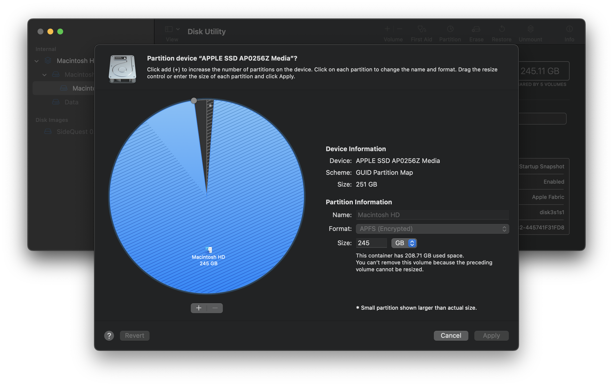

# 💻 How I installed Ubuntu on an iMac 💻

_For the more precise amongst us: Ubuntu 22.04 LTS on the 2019 iMac 21.5"_

I made this tutorial since for various sections of this process, since a lot of tutorials (whilst they do give detailed instructions) they're not forwards compatible with breaking changes both Apple and the Ubuntu open source community have made / will make. Which increase the difficulty of getting Ubuntu to run smoothly on Mac.

<br />

### `The usual "don't blame me if this goes wrong!" text (please don't though 🥲):`

<br />

**DISCLAIMER**: Whilst I'll provide universal instructions to install this on other flavours of Ubuntu + other types of Macs, I can only vouch for this working fully on the **Ubuntu 22.04 LTS** on the **2019 iMac 21.5"**

**DISCLAIMER 2**: Make sure you backup all of your data before attempting this, if you're unsure about any step in this tutorial then do further research or seek advice from a professional. **I do not accept any responsibility for any data loss or the loss of function of your computer.**

<br />

... With that said, let's continue with the tutorial! :)

## Prerequisites

- Some form of Mac (MacBook, iMac, Mac Mini etc)
- External media (e.g. USB thumb drive) to flash the iso file to
- Ethernet connectivity for the Mac (Wi-Fi won't work straight away on Ubuntu)
- A spare computer to format the USB with (whilst this process is entirely possible with just using the Mac, you should have another computer handy on the chance that something goes wrong)
- A spare USB keyboard and mouse

  (Just in case! For MacBooks your built in keyboard + trackpad may not work instantaneously. For iMac's, the magic keyboard will suffice if plugged in via cable, but the magic mouse cannot be used whilst plugged in, so you will need another option)

## Partitioning your Mac storage drive

You will need to partition your Mac storage for both the actual Ubuntu installation, and the _'swap space'_ partition for Ubuntu (if you don't know what _swap space_ is please read [here](https://help.ubuntu.com/community/SwapFaq)!)

Follow these steps:

1. Open Disk Utility on your Mac (this can be found in Launchpad or by using Spotlight Search), you should see a screen like this:

   

2. Select the **outer** Macintosh HD **container** (it should say 'volumes' next to it) and then click the 'Partition' button in the top right section, you'll be greeted with this popup:

   

3. Click the + button underneath the partition pie chart, and choose **'Add Partition'**, resize to however much space you'd like to allocate to Ubuntu (a minimum of 15GB is ideal), and set the format type to **"MS-DOS (FAT)"** (this will be changed later), make sure you set the name to something identifiable, like "Ubuntu".

   

   (You'll notice I didn't resize the partition in this GIF, this is just an example to show how to partition, the Mac used in the recording doesn't have a lot of free storage space left)

   <br />

4. Repeat the same process as step 3 but instead this will be for your **'swap space'** partition, read [here](https://help.ubuntu.com/community/SwapFaq) if you're unsure what swap space is.

   In short, it's like virtual RAM for if the system runs out. As such, you should ideally allocate the same size as your RAM to your swap patition. So if your Mac has 16GB of RAM, then your swap space should have 16GB worth of storage space.

   Format as MS-DOS (FAT) as seen in step 3 and name it something identifiable like "SWAP"

## Creating bootable media

You will need 2 iso file(s):

- **An Ubuntu iso file**: [Official Ubuntu Download](https://ubuntu.com/download/desktop) (you may try this with other flavours of Ubuntu at your own discretion)

- **rEFInd iso file**: [rEFInd ISO Download](https://etcher.balena.io/) rEFInd is a boot manager utility / bootloader with support for Mac platforms, allowing you to boot from Mac / Ubuntu _(and even Windows!)_. We will install this using bootable media **AFTER** the Ubuntu installation since in most cases Ubuntu's GRUB bootloader overrides the MacOS default bootloader.

<br />

You will also need:

- A USB flash drive / other external storage hardware to boot from temporarily

- Software to flash the iso's onto a USB flash drive (I recommend [Balena Etcher](https://etcher.balena.io/))

<br />


Once you've opened Etcher you'll be greeted with the above screen. Then follow these steps:

1. Click _'Flash from file'_, select the **Ubuntu** iso file you've downloaded and confirm.

2. Click _'Select target'_, select the USB flash drive you wish to flash the iso to _(be extremely careful here! Whichver device you choose to flash to will have its current contents **permanently erased**)_.

3. Click _'Flash!'_, the process of flashing the ISO to the USB should start and you'll have to wait, dependent on the speed of your computer this may take a bit of time (on average ~7 mins) so make yourself a coffee then come back! 😃

4. Once the process has finished, **safely** eject your USB then move onto the next section!

## Mac Final steps (for now...)

There's a few more things you'll need to do before we move one just to make things easier later:

### Wi-Fi Driver Info:

Open up your terminal and run:

```bash
ioreg -l | grep RequestedFiles
```

Copy and paste the output to a txt file, and save it on a USB / cloud storage or anywhere else that's accessible outside of MacOS once we start installing.

This information is necessary later on to help us locate the [Wi-Fi drivers](#wi-fi) for your Mac

### Unpairing the magic keyboard and mouse (if you're on an iMac)

Open up System Preferences and go to bluetooth and disconnect your keyboard **then** your mouse (to make it easier for the less keyboard shortcut savvy)

Magic keyboards & mice are not discoverable by bluetooth until they've been properly unpaired. There is a workaround that we'll discuss later to keep the pairing on both MacOS and Ubuntu, but requires unpairing on MacOS first.

## Installing Ubuntu (_`the exciting part!!!`_)

Or if you're me, who took ages getting this whole thing to work, it's your 8th time reinstalling 👎.

Nonetheless! here are the steps...

1. Restart your Mac, as soon as you hear the startup music play, hold down the Option ⌥ key until the startup manager shows.

   **Screenshot goes here**

2. You should see a list of bootable devices (dependent on your current setup + connected peripherals, the number could vary), choose the one in yellow marked "EFI", this should be your Ubuntu installation USB

3. (Explain once booted, how to format the ubuntu + swap partitions so they're ready for use)

4. (Explain installation process for Ubuntu briefly here)

5. Restart to your new Ubuntu installation!

## Installing Drivers for Speakers and Wi-Fi

### Speakers

`Credit to https://github.com/davidjo/snd_hda_macbookpro for the drivers`

1. Install the prerequisites:

   ```bash
   sudo apt install gcc linux-headers-generic make patch wget git
   ```

2. Build the driver:

   ```bash
   git clone https://github.com/davidjo/snd_hda_macbookpro.git
   cd snd_hda_macbookpro/
   sudo ./install.cirrus.driver.sh
   reboot
   ```

   _When running the install script you may get the following error (or similar) asking you to install the kernel header packages_

   ```bash
   assuming the linux kernel headers package is not installed
   please install the appropriate linux kernel headers package:
   Debian/Ubuntu: sudo apt install linux-headers-6.2.0
   ```

   Just follow the instructions given to you, the version number for your kernel may not be the same as the above example depending on which Ubuntu distro you installed. Once you've installed the headers, re-run the install script then reboot

3. Once rebooted, use system settings to test the speakers!

   **Screenshot goes here!**

### Wi-Fi
